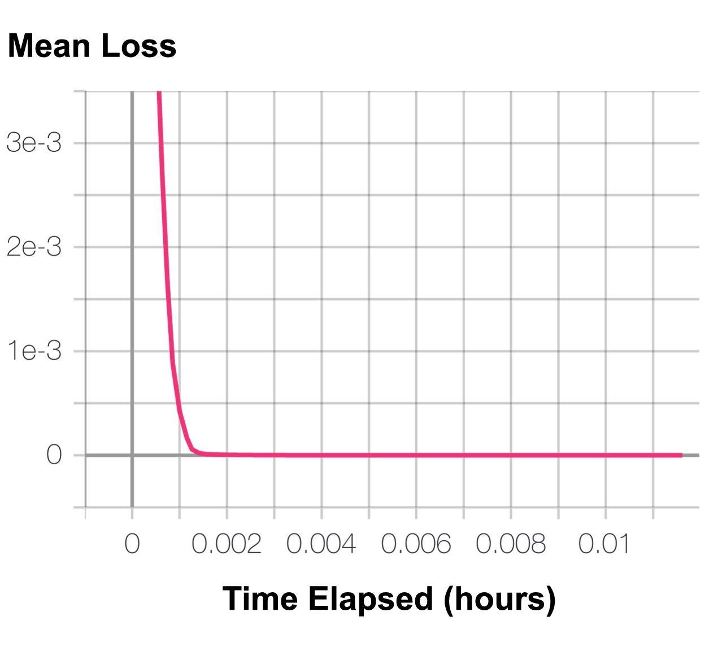
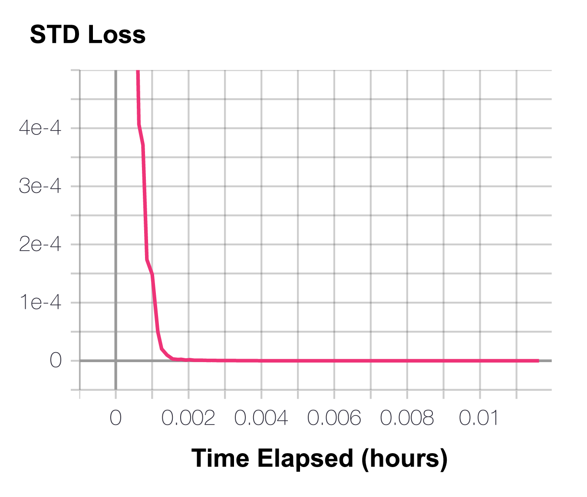

# Behavioral Cloning (BC)

```eval_rst
+-------------------+--------------------------------------------------------------------------------------------------------------+
| **Paper**         | Model-Free Imitation Learning with Policy Optimization :cite:`ho2016model`                                   |
+-------------------+--------------------------------------------------------------------------------------------------------------+
| **Framework(s)**  | .. figure:: ./images/pytorch.png                                                                             |
|                   |    :scale: 10%                                                                                               |
|                   |    :class: no-scaled-link                                                                                    |
|                   |                                                                                                              |
|                   |    PyTorch                                                                                                   |
+-------------------+--------------------------------------------------------------------------------------------------------------+
| **API Reference** | `garage.torch.algos.BC <../_autoapi/garage/torch/algos/index.html#garage.torch.algos.BC>`_                   |
+-------------------+--------------------------------------------------------------------------------------------------------------+
| **Code**          | `garage/torch/algos/bc.py <https://github.com/rlworkgroup/garage/blob/master/src/garage/torch/algos/bc.py>`_ |
+-------------------+--------------------------------------------------------------------------------------------------------------+
| **Examples**      | :ref:`bc_point`, :ref:`bc_point_deterministic_policy`                                                        |
+-------------------+--------------------------------------------------------------------------------------------------------------+
```

Behavioral cloning is a simple immitation learning algorithm which maxmizes the likelhood of an expert demonstration's actions under the apprentice policy using direct policy optimization. Garage's implementation may use either a policy or dataset as the expert.

## Default Parameters

```python
policy_optimizer = torch.optim.Adam
policy_lr = 1e-3
loss = 'log_prob'
batch_size = 1000
```

## Examples

### bc_point

```eval_rst
.. figure:: ./images/pytorch.png
        :scale: 10%
.. literalinclude:: ../../examples/torch/bc_point.py
```

### bc_point_deterministic_policy

#### Experiment Results

 

```eval_rst
.. figure:: ./images/pytorch.png
        :scale: 10%
.. literalinclude:: ../../examples/torch/bc_point_deterministic_policy.py
```

## References

```eval_rst
.. bibliography::
   :style: unsrt
   :filter: docname in docnames
```

----

*This page was authored by Iris Liu ([@irisliucy](https://github.com/irisliucy)) with contributions from Ryan Julian ([@ryanjulian](https://github.com/ryanjulian)).*
