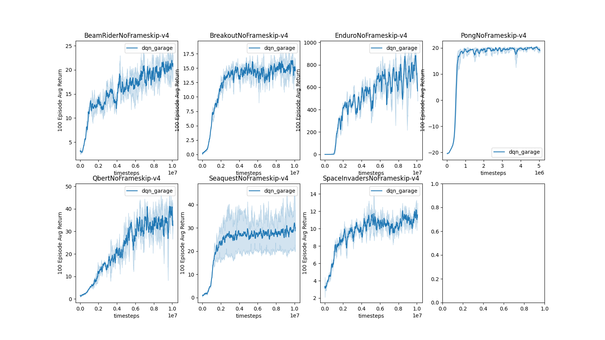

# Deep Q Networks (DQN)

```eval_rst
+-------------------+---------------------------------------------------------------------------------------------------------------------------------------------------------------------------------------------------------------------------------+
| **Paper**         | Playing Atari with Deep Reinforcement Learning. :cite:`mnih2013playing`                                                                                                                                                         |
+-------------------+------------------------------------------------------------------------------------------------------------------+--------------------------------------------------------------------------------------------------------------+
| **Framework(s)**  | .. figure:: ./images/pytorch.png                                                                                 | .. figure:: ./images/tf.png                                                                                  |
|                   |    :scale: 10%                                                                                                   |    :scale: 20%                                                                                               |
|                   |    :class: no-scaled-link                                                                                        |    :class: no-scaled-link                                                                                    |
|                   |                                                                                                                  |                                                                                                              |
|                   |    PyTorch                                                                                                       |    TensorFlow                                                                                                |
+-------------------+------------------------------------------------------------------------------------------------------------------+--------------------------------------------------------------------------------------------------------------+
| **API Reference** | `garage.torch.algos.DQN <../_autoapi/garage/torch/algos/index.html#garage.torch.algos.DQN>`_                     | `garage.tf.algos.DQN <../_autoapi/garage/tf/algos/index.html#garage.tf.algos.DQN>`_                          |
+-------------------+------------------------------------------------------------------------------------------------------------------+--------------------------------------------------------------------------------------------------------------+
| **Code**          | `garage/torch/algos/dqn.py <https://github.com/rlworkgroup/garage/blob/master/src/garage/torch/algos/dqn.py>`_   | `garage/tf/algos/dqn.py <https://github.com/rlworkgroup/garage/blob/master/src/garage/tf/algos/dqn.py>`_     |
+-------------------+------------------------------------------------------------------------------------------------------------------+--------------------------------------------------------------------------------------------------------------+
| **Examples**      | `examples <algo_dqn.html#examples>`_                                                                                                                                                                                            |
+-------------------+---------------------------------------------------------------------------------------------------------------------------------------------------------------------------------------------------------------------------------+
```

Deep Q Networks, or simply DQN, is a staple off-policy method ontop of which many more recent algorithms were developed. It uses a learned Q function to obtain estimates for the values of each state, action pair (S,A), and selects the optimal value by simply taking the argmax of all Q values. The algorithm is most known for learning policies that perform well on a large suite of Atari games.

## Supported DQN Variants

As of now, both the Tensorflow and PyTorch implementations support Double DQN and Dueling DQN, as well as both combined. Double DQN can be used by simply passing a flag to the algorthim:

```python
algo = DQN(policy=policy,
           double_q=True,
           ...)
```

Dueling DQN can be used by passing in a Q function with the dueling architecture to algorithm. When using the Tensorflow branch, a dueling Q function can be constructed as follows:

```python
qf = DiscreteCNNQFunction(env_spec=env.spec,
                          dueling=True,
                          ...)
```

See the Pong example below for a full launcher file.

In the Pytorch branch, the architecture belongs to its own class:

```python
qf = DiscreteDuelingCNNQFunction(env_spec=env.spec,
                                 ...)
```

See the Atari launcher below for a full example.

## Examples

Both the Tensorflow and PyTorch branches of garage contain several DQN examples.

### Pytorch

The PyTorch branch provides an Atari launcher (see below) that allows you to easily run experiments from the command line like so:

```bash
# train on PongNoFrameskip-v4 for 10M steps
python examples/torch/dqn_atari.py Pong --seed 22 --n_steps 10e6
```

by default, all the hyperparameters stored in the `hyperparams` dict at the top of the launcher file, as well as the ones passed in via the command line, are stored in the `variant.json` file in the experiment's directory. You can use this feature to quickly compare hyperparameters between multiple runs.

The training curves for Dueling DQN on the Atari-10M suite are included below.




```eval_rst
.. literalinclude:: ../../examples/torch/dqn_atari.py
```

```eval_rst
.. literalinclude:: ../../examples/torch/dqn_cartpole.py
```

### TF

```eval_rst
.. literalinclude:: ../../examples/tf/dqn_cartpole.py
```

```eval_rst
.. literalinclude:: ../../examples/tf/dqn_pong.py
```

## References

```eval_rst
.. bibliography:: references.bib
   :style: unsrt
   :filter: docname in docnames
```

----

*This page was authored by Mishari Aliesa ([@maliesa96](https://github.com/maliesa96)).*
