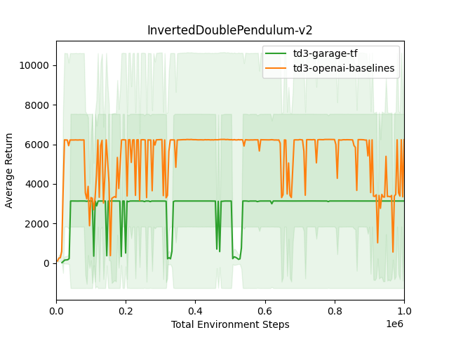

# Twin Delayed Deep Deterministic (TD3)

```eval_rst
+-------------------+--------------------------------------------------------------------------------------------------------------------------------------------------------------------------------------------------------------------------------------------------------------+
|     **Paper**     |                                                                               Addressing Function Approximation Error in Actor-Critic Methods :cite:`Fujimoto2018AddressingFA`                                                                               |
+-------------------+--------------------------------------------------------------------------------------------------------------------------+-----------------------------------------------------------------------------------------------------------------------------------+
|  **Framework(s)** | .. figure:: ./images/tf.png                                                                                              | .. figure:: ./images/pytorch.png                                                                                                  |
|                   |   :scale: 20%                                                                                                            |   :scale: 10%                                                                                                                     |
|                   |   :class: no-scaled-link                                                                                                 |   :class: no-scaled-link                                                                                                          |
|                   |                                                                                                                          |                                                                                                                                   |
|                   |    Tensorflow                                                                                                            |    PyTorch                                                                                                                        |
|                   |                                                                                                                          |                                                                                                                                   |
+-------------------+--------------------------------------------------------------------------------------------------------------------------+-----------------------------------------------------------------------------------------------------------------------------------+
| **API Reference** | `garage.tf.algos.TD3 <https://garage.readthedocs.io/en/latest/_autoapi/garage/tf/algos/index.html#garage.tf.algos.TD3>`_ | `garage.torch.algos.TD3 <https://garage.readthedocs.io/en/latest/_autoapi/garage/torch/algos/index.html#garage.torch.algos.TD3>`_ |
+-------------------+--------------------------------------------------------------------------------------------------------------------------+-----------------------------------------------------------------------------------------------------------------------------------+
|      **Code**     | `garage/tf/algos/td3.py <https://github.com/rlworkgroup/garage/blob/master/src/garage/tf/algos/td3.py>`_                 | `garage/torch/algos/td3.py <https://github.com/rlworkgroup/garage/blob/master/src/garage/torch/algos/td3.py>`_                    |
+-------------------+--------------------------------------------------------------------------------------------------------------------------+-----------------------------------------------------------------------------------------------------------------------------------+
|    **Examples**   | :ref:`td3_pendulum_tf`                                                                                                   | :ref:`td3_pendulum_pytorch`, :ref:`td3_halfcheetah_pytorch`                                                                       |
+-------------------+--------------------------------------------------------------------------------------------------------------------------+-----------------------------------------------------------------------------------------------------------------------------------+
|   **Benchmarks**  | :ref:`td3_garage_tf` , :ref:`Tensorflow benchmark results`                                                               | :ref:`td3_garage_pytorch`, :ref:`PyTorch benchmark results`                                                                       |
+-------------------+--------------------------------------------------------------------------------------------------------------------------+-----------------------------------------------------------------------------------------------------------------------------------+
```

Twin Delayed Deep Deterministic (TD3) is an alogrithm motivated by Double Q-learning and built by taking the minimum value between two critic networks to prevent the overestimation of the value function. Garage's implementation is based on the paper's approach, which includes clipped Double Q-learning, delayed update of target and policy networks as well as target policy smoothing.

## Default Parameters

```py
target_update_tau=0.01,
policy_lr=1e-4,
qf_lr=1e-3,
discount=0.99,
exploration_policy_sigma=0.2,
exploration_policy_clip=0.5,
actor_update_period=2,
```

## Examples

### td3_pendulum_tf

```eval_rst
.. literalinclude:: ../../examples/tf/td3_pendulum.py
```

### td3_pendulum_pytorch

```eval_rst
.. literalinclude:: ../../examples/torch/td3_pendulum.py
```

### td3_halfcheetah_pytorch

```eval_rst
.. literalinclude:: ../../examples/torch/td3_halfcheetah.py
```

## Benchmarks

### PyTorch benchmark results

 
 
 

### Tensorflow benchmark results

 
 


### td3_garage_tf

```eval_rst
.. literalinclude:: ../../benchmarks/src/garage_benchmarks/experiments/algos/td3_garage_tf.py
```

### td3_garage_pytorch

```eval_rst
.. literalinclude:: ../../benchmarks/src/garage_benchmarks/experiments/algos/td3_garage_pytorch.py
```

## References

```eval_rst
.. bibliography::
   :style: unsrt
   :filter: docname in docnames
```

----

*This page was authored by Iris Liu ([@irisliucy](https://github.com/irisliucy)).*
