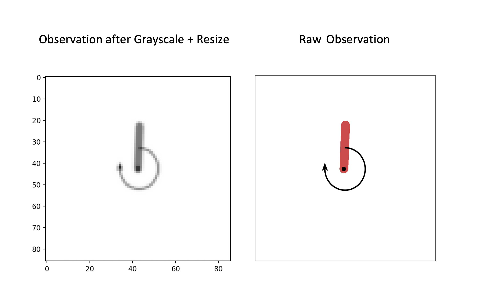

# Use Image Observations

Although most environments return observations that somehow describe the
physical state of the agent and environment, others return observations that
contain spatial data instead. As an example, consider the `MemorizeDigits-v0`
gym environment, where the agent must memorize what each digit looks like using
RGB observations such as:

```
  ---------------------------
 |                           |
 |         ******            |
 |         ******            |
 |       **      **          |
 |       **      **          |
 |               **          |
 |               **          |
 |           ****            |
 |           ****            |
 |       ****                |
 |       ****                |
 |       **********          |
 |       **********          |
 |                           |
  ---------------------------
```

Image observations can be represented as tensors containing each individual
pixel's RGB value. Typically these tensors have the shape `(HEIGHT, WIDTH,
CHANNELS)` where CHANNELS denotes the number of channels. RGB images have 3
channels and grayscale images have 1 channel.

This page will guide you through managing these image observations and
environments.

## Pixel Environments

The following gym environments have been tested with garage and have examples
written for them:

* `MemorizeDigits-v0` - see `examples/tf/ppo_memorize_digits.py`
* `CubeCrash-v0`- see `examples/tf/trpo_cubecrash.py`
* `PongNoFrameskip-v4` - see `examples/tf/dqn_pong.py`

Gym environments that do not return pixel observations by default can be used
with `garage.envs.wrappers.PixelObservationWrapper`, which overrides the default
observation and instead returns a tensor of RGB values by making calls to
`env.render(mode='rgb_array')`. See the section on this wrapper below for more
on this.

## Environment Wrappers

Garage includes various environment wrappers that are particularly useful when
working with pixel observations. You may use multiple wrappers simultaneously,
though the order in which you use them matters. See the pixel-specific wrappers
section for more details on this.

### GymEnv

When wrapping image-based environments in `GymEnv`, `is_image` should be set
to `True`:

```python
env = GymEnv(gym.make('MemorizeDigits-v0'), is_image=True)
```

This converts the `gym.spaces.Box` observation space to an `akro.Image` space,
which then:

* Tells CNN primitives in garage to normalize pixel values to between 0 and 1.
  This typically decreases training time, particularly in environments where
  observation values vary widely. Note that for memory optimization purposes,
  this is only done internally within the primitives, so calls to `env.step()`
  will still return raw pixel values. This ensures that pixel values are held in
  memory as integers (ideally 8-bit integers, ie. `uint8`), and are only
  converted to `float32` values when passed to CNN primitives.

* Unflattens observations when necessary to preserve relationships between
  spatial data.

### Pixel-Specific Wrappers

These are used to modify the environment observations, usually in ways that
would reduce the input size and improve training speed. They can be found in the
`garage/envs/wrappers` directory. The ones to note here are:

#### PixelObservationWrapper

This wraps around environments that typically produce observations that are not
images, and instead generates pixel observations from the wrapped environment.
The behavior of this wrapper is similar to that of
`gym.wrappers.pixel_observation.PixelObservationWrapper`, except that the gym
wrapper returns a `gym.spaces.Dict` observation space:

```python
from gym.wrappers.pixel_observation import PixelObservationWrapper as gymWrapper
from garage.envs.wrappers import PixelObservationWrapper as garageWrapper

env = gym.make('Pendulum_v0')
# env.observation_space == Box(3,)
env.reset() # needed when using gym's wrapper
gym_wrapped = gymWrapper(env)
# gym_wrapped.observation_space == Dict({'pixels':Box(1000, 1000, 3)})
garage_wrapped = garageWrapper(env)
# garage_wrapped.observation_space == Box(1000, 1000, 3)

```

Notice that the resulting observation space is 3-dimensional, and now represents
the RGB pixel values.

#### Grayscale

As the name implies, this wrapper converts a 2D RGB image into a single-channel,
grayscale image. This can only be applied to 3-channel images.

```python
env = gym.make('Env')
# env.observation_space.shape == (100, 100, 3)
env_wrapped = Grayscale(env)
# env_wrapped.observation_space.shape == (100, 100)
```

#### Resize

It is a good idea to use this wrapper to scale down image observations,
especially when dealing with large images. In the `PixelObservationWrapper`
example above, the images are 1000 px by 1000 px. Images of this size will
drastically increase training time, and is unnecessary when information about
the environment can be discerned from a lower resolution image.

You should be careful not to downsample images to the point where information is
lost. A good way to check this is to plot the observations using matplotlib:

```python
import gym
import matplotlib.pyplot as plt
import matplotlib.image as mpimg
from garage.envs.wrappers import PixelObservationWrapper, Grayscale, Resize

env = gym.make('Pendulum-v0')
env = PixelObservationWrapper(env)
env = Grayscale(env)
# env.observation_space.shape == (100, 100)
env_wrapped = Resize(env, 86, 86) # env, width, height
# env_wrapped.observation_space.shape == (86, 86)

obs = env.reset()
plt.imshow(obs, cmap='gray', vmin=0, vmax=255) #grayscale colormap
plt.show()
```


Note that *size* here refers to its resolution, so images are *not* cropped.
Only 2D single-channel images can be resized, so this wrapper is usually applied
after the `Grayscale` wrapper.

#### StackFrames

Frame stacking is a technique used in RL to create observations from which
temporal data can be inferred. As a concrete example, consider the `Pendulum-v0`
environment where the agent must balance the pendulum vertically by applying
some amount of torque to the shaft. To do this reliably, the agent needs to
infer both the current position of the pendulum and the direction in which it is
moving. The former is given by the current image observation, but the latter
cannot be inferred from one image alone. To combat this, you can stack N (say,
3) images into one , which would embed this information into one observation.

Frames are stacked on a rolling basis. When stacking N frames, the N most recent
frames are returned as the observation. Moreover, stacking frames does not
affect the width or height of the images, only the number of channels in the
final observation.

You can only use StackFrames with single-channel images.

```python
env = gym.make('SingleChannelEnv')
# env.observation_space.shape == (100, 100)
wrapped_env = StackFrames(env, 2) # stack last 2 frames
# wrapped_env.observation_space.shape == (100, 100, 2)
```

## Example

The following script demonstrates how you would use the aforementioned options
in a launcher file

```python
def  pixel_observations_example(ctxt=None, seed=1, buffer_size=int(1e4)):
    set_seed(seed)

    with TFTrainer(snapshot_config=ctxt) as trainer:

        env = gym.make('Pendulum-v0')
        env = PixelObservation(env) # goes first
        env = Grayscale(env)
        env = Resize(env, 86, 86)
        env = StackFrames(env, 2) # goes after all pixel wrappers

        env = GymEnv(env, is_image=True) # goes last

        ...
        # setup policy, Q function, etc.
        # pass env to the algorithm

```

----

*This page was authored by Mishari Aliesa ([@maliesa96](https://github.com/maliesa96)).*
